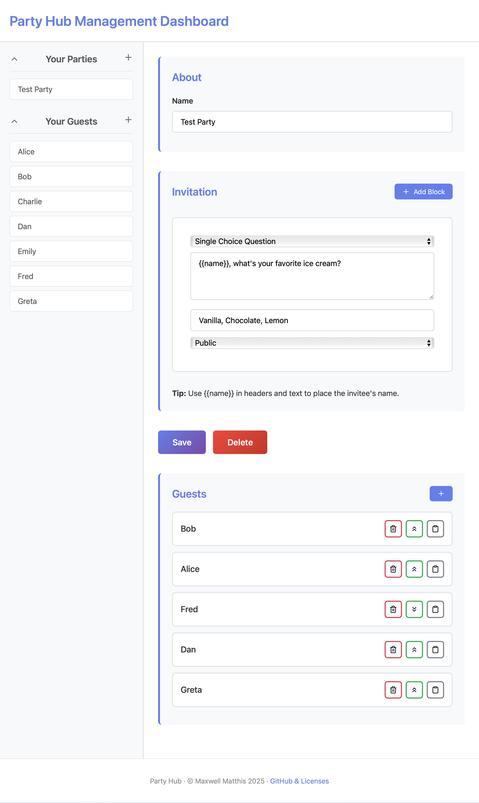
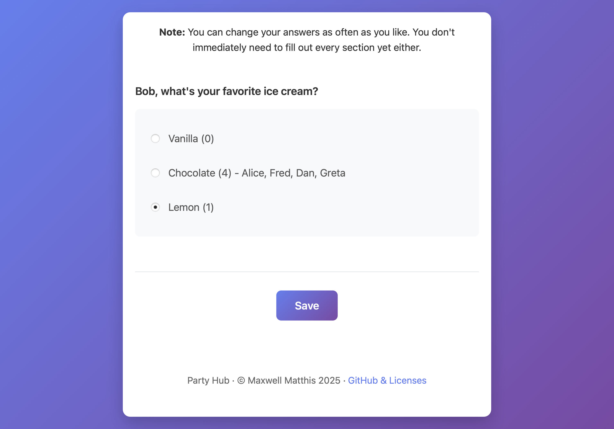

# Party Hub

A modern, minimalistic party invitation platform built with Rust (Actix Web), SQLite, and vanilla JavaScript. Create beautiful party invitations with custom questions, gather responses, and display public statistics in real-time.


*Management interface for creating parties and managing guests*


*Guest-facing invitation with real-time statistics*

## Features

- 🎉 **Custom Party Creation**: Create parties with flexible block-based invitation editor
- 📝 **Multiple Question Types**:
  - **Text Input**: Free-form text responses
  - **Number Input**: Numeric responses
  - **Single Choice**: Radio button selections with live vote counts
  - **Multiple Choice**: Checkbox selections with live vote counts
- 👥 **Guest Management**: Easy guest creation, invitation system, and organizer privileges
- 📊 **Real-time Statistics**: Public questions show live vote counts and guest names as responses come in
- 🔒 **Privacy Controls**: Questions can be marked as public (visible to all) or private (organizer-only)
- 📱 **Responsive Design**: Modern, clean UI that works on all devices
- ⚡ **Live Updates**: Vote counts update instantly when you make selections
- 🌐 **Localization**:
  - Automatic language detection based on browser preferences
  - Full German and English support
  - Informal German ("du") for friendly communication
- 👤 **Guest Personalization**: Use template variables in your content:
  - `{{salutation}}` - Guest's salutation (e.g., Mr., Ms., Dr.)
  - `{{first}}` - Guest's first name
  - `{{last}}` - Guest's last name
  - `{{name}}` - Full name (first + last) for backward compatibility
- 🔐 **Secure Authentication**: Token-based authentication for party organizers

## Quick Start

### Prerequisites

- Rust (latest stable version)
- SQLite3

### Installation & Setup

1. **Clone and run**:

   ```bash
   git clone https://github.com/maxwellmatthis/party-hub.git
   cd party-hub
   cargo run
   ```

   The server will start on `http://localhost:8080`

2. **Create your first author account**:

   ```bash
   ./createAuthor.sh "Your Name"
   ```

   Save the generated secret to log into the management interface.

### Environment Variables

Party Hub supports the following environment variables for configuration:

- **`PORT`**: Set the server port (default: 8080)

  ```bash
  export PORT=3000
  cargo run
  ```

- **`ENV`**: Set the environment mode (default: "prod")
  - `ENV=dev`: Enables development mode with insecure cookies for localhost testing
  - `ENV=prod`: Production mode with secure cookies (default)

  ```bash
  export ENV=dev
  cargo run
  ```

## License

This project is licensed under the **GNU Affero General Public License v3.0** (AGPLv3). See the LICENSE file for details.
